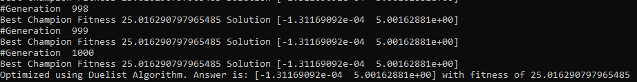
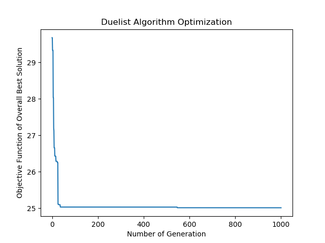

# Duelist-Algorithm-Python [](https://travis-ci.com/tsyet12/Duelist-Algorithm-Python)
A Python implementation of the paper : 
Duelist Algorithm: An Algorithm Inspired by How Duelist Improve Their Capabilities in a Duel (2015) <b>
Totok Ruki Biyanto, Henokh Yernias Fibrianto, Gunawan Nugroho, Erny Listijorini, Titik Budiati, Hairul Huda <b>
https://arxiv.org/abs/1512.00708

I would like to clarify that various figures of this README.md document is taken from the original artical as shown above.


# Theory (From Biyanto et al., 2015)
Duelist Algorithm is a metaheuristic for mathematical optimization problems. Metaheuristic are a higher-level procedure or heuristic designed to find, generate, or select a heuristic (partial search algorithm) that may provide a sufficiently good solution to an optimization problem, especially with incomplete or imperfect information or limited computation capacity. Examples for metaheuristics include genetic algorithm, particle swarm optimization, etc. Many of these metaheuristics rely on population-based search, which utilizes many "searchers" (also refered to as "particles" or "swarms") to simultaneously search the solution space.

The procedure of Duelist Algorithm is shown in the figure below (see Fig 1). Quoting from the authors:
>The Duelist Algorithm starts with an initial set of duelists. The duel is to determine the winner and loser. The loser learns from the winner, while the winner try their new skill or technique that may improve their fighting capabilities. A few duelists with highest fighting capabilities are called as champion. The champion train a new duelists such as their capabilities. The new duelist will join the tournament as a representative of each champion. All duelist are re-evaluated, and the duelists with worst fighting capabilities is eliminated to maintain the amount of duelists. 

 <b>
  
*Fig 1. Flowchart of Duelist Algorithm*

In the Duelist Algorithm, the best solutions in a population are chosen as the champions, while worst solutions are eliminated (see Fig 2). Winner mutates themselves and attempts to improve, while losers learns from winner (has a chance to copy traits of winner).

 <b>
  
*Fig 2. Champion selection and worst elimination*

In the original paper, Duelist Algorithm was shown to out-perform a few state-of-art metaheuristic algorithm for some specific tasks (see Fig 3). Therefore, it is very interesting.

 <b>
  
*Fig 3. Performance of Duelist Algorithm from original paper*

# Dependencies
This algorithm is fully implemented in Python. It is recommended to use Python 3.X. Library dependencies: <b>
- numpy 1.15.4
	
```BASH
$ pip install numpy
```

<b>

# How to Use
First download the git repository. You can do this by clicking the download button or using the git command:
```BASH
$ git pull https://github.com/tsyet12/Duelist-Algorithm-Python
```
<b>
  
Move to the directory:
  
```BASH
$ cd (directory of Duelist-Algorithm-Python)
```

Run setup. The following command installs all files in directory:

```BASH
$ pip install -e .
```

Move to examples and run the examples

```BASH
$ cd examples
```

# Short Tutorial

**There are four simple steps to run an optimization problem using Duelist Algorithm**

(Example 2 from example folder)

** Prerequisites **

```python
from solver.Duelist_Algorithm import DuelistAlgorithm
```

** 1. Define your function. Say you want to minimize the equation f=(x1,x2) = (x1)^2+(x2)^2 **

```python
def f(x1,x2):
	return x1*x1+x2*x2
```

** 2. Define the variables that can be *manipulated* for optimization. Define their names as string and put them in an array. **

```python
x=["x1","x2"]
```

** 3. Define the boundaries for the manipulated variables:**

 Say:

 x1 is bounded from -2 to 10 (-2 is min value of x1 and 10 is max value of x1)

 x2 is bounded from 10 to 15 (10 is min value of x2 and 15 is max value of x2)

 We can arrange these boundaries according to the definition array in step 2.

```python
 xmin=[-2,5]
 xmax=[10,15]
```

** 4. Setup the solver and start the solve procedure. **

```python
DA=DuelistAlgorithm(f,x,xmin,xmax,max_gen=1000)
DA.solve(plot=True)
```

***RESULTS***

From the console we can deduce the optimal result (see Fig. 4) . The global optimal has a fitness of 25, while duelist algorithm found 25.01. Error of 0.01 can be reduced by putting more maximum generations in solver.


*Fig 4. Optimal Results in Console*

We can see that the algorithm quickly converges to the optimal point (see Fig. 5) as reported by the original article.


*Fig 5. Quick convergence of Duelist Algorithm*

For more examples refer to the python scripts in "examples" folder. [https://github.com/tsyet12/Duelist-Algorithm-Python/tree/master/examples]


# Version

Currently Version 1.0

# To-do
- [X] Setup algorithm and show optimized solution

- [X] Create Tutorials

- [X] Update ReadMe

- [X] Add plot functions

- [ ] Add a modified feature for faster convergence

- [ ] Add result loging and export to csv


# Contact Me

If you have ideas or some opportunities for collaboration, feel free to send me an email. I will respond quickly.

My email: tsyet12@gmail.com
